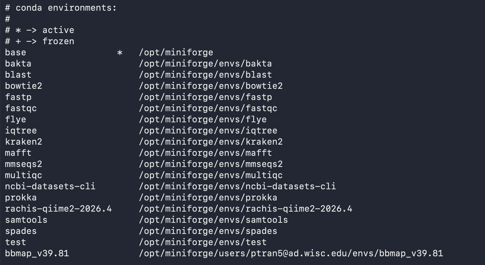

# Overview and suitable uses

::: callout-important
This is a work in progress! The guide will be officially launched later in August 2026. You are welcome to read it now, but also visit again later for more information.
:::

The **Department of Bacteriology** computer server is available for researchers in the Department of Bacteriology free of use. It has been repurposed from previous IT needs and is currently available for research needs.

As a result, the server **should not be expected** to be expanded or upgraded for additional compute power in the future; rather is just to provide an additional compute environment for learning and analyzing small datasets if needed. The server will be supported from Summer 2026 to its natural end-of-life, in a few years (no exact date).

The departmental server is suitable for:

- Learning simple bioinformatics skills like the command and software installation and usage

- Analyzing small datasets (your own data or test data)

- Quickly checking or testing a software you will want to use as part of a larger project

If you are working on an analysis-heavy project, other free campus compute resources might be more suitable. **The Bioinformatics Research Support Service will be happy to meet with you to advise on what compute resource + training is most suited for your project needs, and where you currently are in your bioinformatics learning journey.**

For example, we train many researchers in implementing their bioinformatics work on the [Center for High Throughput Computing (CHTC) HTC cluster](https://chtc.cs.wisc.edu/uw-research-computing/form.html).

All the core skills you are using on the departmental server will be transferable to scaling your work on larger-scale computing resources. We actually work closely with their research facilitation team and meet with them monthly to update each other on what biologists are using research computing for!

The Dept of Bacteriology's Bioinformatics Research Support Service will be happy to meet with you frequently or as needed to teach you some more advanced topics needed to use the departmental server and the compute resources or our campus partners.

### Requesting access

To request access, please fill out this [Google Form](https://forms.gle/HQ7jw9eRa3FL6xwcA).

The form will ask you about:

- Name and lab affiliation

- Summary of the type of bioinformatics work you would like to do on the server

- General idea of how much data storage you will need

- End date of the server access

Once you submit the form, we will be notified by e-mail that you have submitted something.

You will then receive an e-mail confirming that you have been added within 1-2 business days (except during holidays and our time-off). If necessary, we might ask for more questions to understand your project.

## Policies and Expectations

1.  Accounts are linked with your UW-Madison netid and you should not share you log in information with others.
2.  The server is for academic research use only.
3.  You must comply with all UW institutional policies (<https://data.wisc.edu/institutional-data-policy/>), and all local, state and federal laws.
4.  Protected data should not be imported into the server nor analyzed on the server. For more details on data classification, visit: <https://data.wisc.edu/data-governance/data-classification/>

We will be **strict** on rules **1-4**, and if we noticed that we will deactivate your account immediately, and let you know and your PI know.

Additional usage rules:

5.  Always test your jobs using a minimal number of CPUs (at most 4) before running it on your real dataset.
6.  When running jobs (see How-to section of the guide), limit the \# of cpus to at most 8 even on real jobs.
7.  In addition, to 6, always check the current memory and cpus load and adjust your cpus if other concurrent jobs are running.

Testing and running jobs might be more tricky, and and we understand that mistakes can happen, especially as you are learning how to use the server or learning to use the command line.

If we notice not following these rules, we will contact you by e-mail if we notice anything strange and you will have chances to rectify the situation. This can happen 3 times before we deactivate your account.

If the situation is more severe and your job is taking over the server and affecting the performance of the system, we reserve the right to immediately cancel your job. Hence, it is important for you to keep track of the code you run (or have ran) in scripts so you can adjust and rerun it if that happens. This counts towards the **3-warnings** limit we apply to all users.

## Technical Server Specs

The server provides:

- 48 physical CPU cores (96 logical CP hyperthreading enabled)
- 384 GB of RAM
- Approximately 1.8 TB of usable local storage
- The current (08/2026) storage space in `/home/` is 100GB across all users. This is where you can store small text files such as scripts.
- Scratch space: `/mnt/scratch` is 600GB. This is where large input and output files go.

::: callout-note
We have currently implemented a 10GB per home per user and 60GB per /mnt/scratch per user, limiting our server available to 10 user accounts at once. As we roll it out and get a better sense of how many people want to use it, this can change. Stay tuned and/or let me know your thoughts!
:::

## Usage policies

### CPU

- Be considerate of other users.

- Never use all 96 CPUS. We recommend \~16CPU per user per job.

- Limit overall load to 75CPUS across all users and jobs at once. Check system load with `htop`.

### Memory

- If you want to run a job with \>250 GB RAM, please contact us ahead of time for now.

### Storage

- Store scripts and small files in `/home/netid@ad.wisc.edu` directories. Home directories are **100GB** across **all users**. Each user has a quota of **10GB** by default.

- Store your datasets in `/mnt/scratch`. The Scratch directories are **600GB** combined across **all users**. Each user starts with a quota of **60GB**.

- You are responsible for removing unused files and environments regularly.

- Use `conda clean –all` once in a while to clean your conda environments and save disk space.

  ::: callout-important
  If a user exceeds the soft cap, they will have 30 days to clear enough space to sit below the soft cap before they cannot write to the directory anymore.
  :::

### Shared Resources

- The server is a shared resource so please be mindful of your usage and what other people might have running on the server at the same time.

## Software available

To use software, we have conda environments set up. Conda is a software package managers that allows us to create distinct environments where distinct versions of software is installed. 

Conda (miniforge, technically) environments are organized this way on the server:

- **“Gold” environments**: we have pre-installed these for all users. Located at this path: `/opt/miniforge` . Users can simple activate the environment of their choice to begin using the software.

- **User-created environments**: If a software you want to use is not pre-installed, you can create your own conda environment, and your environments will be saved at this path: `/opt/miniforge/users/<your NetID>/envs`. Other users on the server will not be able to see the environments under your NetID.

::: callout-tip
Check out the section "How to –\> Using software" for more information!
:::

## Databases

Certain common bioinformatics software requires large databases and will be stored in `/mnt/scratch/databases`. Paths to specific databases are listed in the section How To –\> Using Software –\> Use "Gold Images" when they will become available.

Due to the storage limitations of the repurposed server, we don’t host too many databases. However, we have large databases such as `AlphaFold3`, `NCBI Blast NR`, `GTDB-tk` (multiple versions), on the CHTC HTC cluster – which we can help you learn how to use as well. 

::: callout-note
As we are just launching this in 08/2026, we have not prioritized which databases to include yet. Let me know if you have any suggestions please.
:::

## Data storage

### Research Drive

When we planned for setting-up this server, we discussed with CALS IT about the possibility to link [ResearchDrive](https://it.wisc.edu/services/researchdrive/) on here. This will be done on a case-by-case basis with each PI. If you are interested in this option, please let me know.

However, if your data is stored in ResearchDrive but it's quite small (a few GB), you can simply use regular file transfer tools like `scp` (see section #Importing and Exporting Data) to transfer files.

## Back-ups

We currently do not have an automatic back-up service for the server. Please transfer out your relevant output files. **NEVER** use the server as your sole storage space for your data. A good practice for data backup with the 3-2-1 backup rule: keep 3 copies of your data: original and two backups, two types of media, and 1 copy offsite such as cloud storage (like Box, GoogleDrive, Box).

# How-to

## The command line

A command line (or CLI) is **a text-based interface used to interact with a computer’s operating system**. Instead of clicking icons with a mouse, you type specific text commands to navigate files, run programs, and manage system settings.

You can find a number of tutorials online if you search for terms like : "intro to the command line" "how to use the command line" "unix shell introduction", etc.

If you are looking for a step-by-step written tutorial I recommend [The Carpentries Introduction to the Unix Shell course](https://swcarpentry.github.io/shell-novice/01-intro.html) (free, asynchronous), especially the section "Navigating files and directories".

Below are a list of useful commands:

+-----------------+---------------------------------+---------------------------------------------------------------------------------+---------------------------------------------------------------------------------+
| Command         | Full Name / Meaning             | Description & Primary Usage                                                     | Common Examples                                                                 |
+:================+:================================+:================================================================================+:================================================================================+
| `pwd`           | Print Working Directory         | Displays the absolute path of the directory you are currently in.               | `pwd`                                                                           |
+-----------------+---------------------------------+---------------------------------------------------------------------------------+---------------------------------------------------------------------------------+
| `ls`            | List                            | Lists files and directories in the current or specified directory.              | `ls`<br>`ls -lh`<br>`ls -lht`                                                   |
+-----------------+---------------------------------+---------------------------------------------------------------------------------+---------------------------------------------------------------------------------+
| `cd`            | Change Directory                | Moves your current location to a different folder.                              | Directly to the path (`cd /path/to/directory`)                                  |
|                 |                                 |                                                                                 |                                                                                 |
|                 |                                 |                                                                                 | Up a folder: `cd ..`                                                            |
|                 |                                 |                                                                                 |                                                                                 |
|                 |                                 |                                                                                 | Directly to home: `cd ~` or `cd`                                                |
+-----------------+---------------------------------+---------------------------------------------------------------------------------+---------------------------------------------------------------------------------+
| `mkdir`         | Make Directory                  | Creates a new folder.                                                           | Make directory in current folder:                                               |
|                 |                                 |                                                                                 |                                                                                 |
|                 |                                 |                                                                                 | `mkdir new_folder`                                                              |
|                 |                                 |                                                                                 |                                                                                 |
|                 |                                 |                                                                                 | Make directory at a specific path regardless of where you are:                  |
|                 |                                 |                                                                                 |                                                                                 |
|                 |                                 |                                                                                 | `mkdir -p path/to/nested_dir`                                                   |
+-----------------+---------------------------------+---------------------------------------------------------------------------------+---------------------------------------------------------------------------------+
| `rmdir`         | Remove Directory                | Deletes an *empty* directory.                                                   | `rmdir old_folder`                                                              |
+-----------------+---------------------------------+---------------------------------------------------------------------------------+---------------------------------------------------------------------------------+
| `cp`            | Copy                            | Copies files or directories from a **source** to a destination.                 | Copy file.txt to backup.txt (does not delete file.txt):                         |
|                 |                                 |                                                                                 |                                                                                 |
|                 |                                 |                                                                                 | `cp file.txt backup.txt`                                                        |
|                 |                                 |                                                                                 |                                                                                 |
|                 |                                 |                                                                                 | Copy a whole folder by using the `-r` option:                                   |
|                 |                                 |                                                                                 |                                                                                 |
|                 |                                 |                                                                                 | `cp -r folder/ backup_folder/`                                                  |
+-----------------+---------------------------------+---------------------------------------------------------------------------------+---------------------------------------------------------------------------------+
| `mv`            | Move                            | Moves files/folders to a new location or renames them.                          | `mv file.txt /new/path/`<br>`mv old_name.txt new_name.txt`                      |
|                 |                                 |                                                                                 |                                                                                 |
|                 |                                 | **WARNING!** If you already have a file name new_name.txt it will OVERWRITE it. |                                                                                 |
+-----------------+---------------------------------+---------------------------------------------------------------------------------+---------------------------------------------------------------------------------+
| **CAUTION!!!!** | Remove                          | Deletes files or directories permanently.                                       | `rm unwanted_file.txt`<br>`rm -rf folder_name/`                                 |
|                 |                                 |                                                                                 |                                                                                 |
| `rm`            |                                 |                                                                                 |                                                                                 |
+-----------------+---------------------------------+---------------------------------------------------------------------------------+---------------------------------------------------------------------------------+
| `touch`         | Touch                           | Creates an empty file or updates the timestamp of an existing file.             | `touch script.sh`                                                               |
+-----------------+---------------------------------+---------------------------------------------------------------------------------+---------------------------------------------------------------------------------+
| `cat`           | Concatenate                     | Prints the entire contents of a file directly to the terminal.                  | `cat config.txt`                                                                |
|                 |                                 |                                                                                 |                                                                                 |
|                 |                                 |                                                                                 | Print all the files ending with .txt and redirect to the file name contents.txt |
|                 |                                 |                                                                                 |                                                                                 |
|                 |                                 |                                                                                 | `cat *.txt >> contents.txt`                                                     |
+-----------------+---------------------------------+---------------------------------------------------------------------------------+---------------------------------------------------------------------------------+
| `less`          | Less                            | Opens a file in an interactive, scrollable viewer (`q` to exit).                | `less large_log.txt`                                                            |
+-----------------+---------------------------------+---------------------------------------------------------------------------------+---------------------------------------------------------------------------------+
| `head`          | Head                            | Outputs the first 10 lines of a file by default.                                | `head data.csv`<br>                                                             |
|                 |                                 |                                                                                 |                                                                                 |
|                 |                                 |                                                                                 | Change the number of lines what appear:                                         |
|                 |                                 |                                                                                 |                                                                                 |
|                 |                                 |                                                                                 | `head -n 20 data.csv`                                                           |
+-----------------+---------------------------------+---------------------------------------------------------------------------------+---------------------------------------------------------------------------------+
| `tail`          | Tail                            | Outputs the last 10 lines of a file by default.                                 | `tail data.csv`<br>`tail -f server.log`                                         |
+-----------------+---------------------------------+---------------------------------------------------------------------------------+---------------------------------------------------------------------------------+
| `find`          | Find                            | Searches for files and directories matching specific patterns.                  | `find . -name "*.sh"`                                                           |
+-----------------+---------------------------------+---------------------------------------------------------------------------------+---------------------------------------------------------------------------------+
| `grep`          | Global Regular Expression Print | Search and filter a file based on a text pattern                                | Search for everything `>` in a fasta file (to know how many contigs it has)     |
|                 |                                 |                                                                                 |                                                                                 |
|                 |                                 |                                                                                 | `grep '>' Genome.fasta`                                                         |
|                 |                                 |                                                                                 |                                                                                 |
|                 |                                 |                                                                                 | Search for the word `apple` in the file grocerylist.txt                         |
|                 |                                 |                                                                                 |                                                                                 |
|                 |                                 |                                                                                 | `grep 'apple' grocerylist.txt`                                                  |
+-----------------+---------------------------------+---------------------------------------------------------------------------------+---------------------------------------------------------------------------------+

## Connecting to the Bacteriology server

Once you receive your e-mail confirming that you have been added to the user list that can access the server, you will need to:

- Be connected to the internet, and be on the Bacteriology department VPN or the [UW-Madison campus VPN](https://it.wisc.edu/services/wiscvpn/). 
- Then, you will use your Terminal App (Mac) or an SSH program (Windows; examples: Powershell, Terminal (WSL), PuTTy, MobaXTerm):

`ssh <Net ID>@gipsydanger.bact.wisc.edu`

Replace `<Net ID>` with your own netID, and no need to use the \<\> brackets.

You may need to have your [multi-factor authentication](https://it.wisc.edu/services/duo-multi-factor-authentication-mfa/) nearby.

## Important folders

The first time you log into the system, you will be in your user home, which path is `/home/netid@ad.wisc.edu`by default, where netid will be replace with your own netid. This is where you will store your scripts and small files.

The `/home` storage location is currently 100GB available across all users.

Because of the small folder size for home, the other folder to be aware of the the scratch folder.

`/mnt/scratch/` is where you can store your raw data, input and output files.

## Using software

### First time using conda environments on the server

::: callout-important
Do this regardless on if you plan on using software we have pre-installed or if you plan on installing your own in your own conda environments.
:::

\
To use Miniforge (conda/mamba commands), do the following:

1.  `/opt/miniforge/bin/conda init`

2.  `mamba shell init --shell bash --root-prefix=/opt/miniforge`

3.  Log out and back in

::: callout-note
Notice the presence of the parenthesis with a name in front of your prompt tells you that miniforge (conda) is activated. The default one is `(base)`, but if you type `conda activate envrname`, then it will change to `(envrname)`, hinting to you that you have that current envrname environment activated. This can help you figure out if the commands you want to use are available within that specific environment.
:::

Once you have done this once, you do not need to do this again next time you log in.

### Viewing available software

Once logged into the server, and after having initalized `conda` for the first time, type `conda env list`

An example of the printout is shown here:

- The `*` indicates which environment is activated. Right now, it's `base` and doesn't have any specific software installed.

- The first column is the environment name. Use that name when you do `conda activate name` , for example, `conda activate blast`

- The second column show the path where the software is installed. You don't really need to cd into these folders, but you can use it to distinguish which ones are the `gold images` and which ones are just by you for you. the ones at `/opt/miniforge/envs/` are gold images for everyone, including yourself. The ones are `/opt/miniforge/users/netid` are from/for that specific person.



See the two sections belows for more information the gold images or how to create your own environments.

### Using pre-installed software ("gold images")

From any folder location, you can type `conda env list` to view the most updated list of software available.

Rows in the printout with a link to `/opt/miniforge` are some that we have pre-installed for everyone. Refer to the environment name in the first column to activate the environment of your choice.

For example: `conda activate nameoftheenvr` (replace nameoftheenvr with the actual name). 

The table below shows some software pre-installed for all to use. When applicable, the path to the relevant database is included.

+---------------+----------------------------------------------------------+-----------------------------------------------------------+----------------------------------------+---------------------------------------------------+---------------------------------------+
|               |                                                          |                                                           |                                        |                                                   |                                       |
+===============+==========================================================+===========================================================+========================================+===================================================+=======================================+
| **Software**  | **Use**                                                  | **Name of the conda environment (`conda activate name`)** | **Relevant database path (if needed)** | **Software Version**                              | **Help page**                         |
+---------------+----------------------------------------------------------+-----------------------------------------------------------+----------------------------------------+---------------------------------------------------+---------------------------------------+
| fastqc        | quality checking reads                                   | fastqc                                                    |                                        | FastQC v0.12.1                                    | fastqc -h                             |
+---------------+----------------------------------------------------------+-----------------------------------------------------------+----------------------------------------+---------------------------------------------------+---------------------------------------+
| multiqc       | reporting, summarizing outputs                           | multiqc                                                   |                                        | MultiQC v1.35                                     | multiqc -h                            |
+---------------+----------------------------------------------------------+-----------------------------------------------------------+----------------------------------------+---------------------------------------------------+---------------------------------------+
| fastp         | filtering and trimming reads                             | fastp                                                     |                                        | fastp 1.3.6                                       | fastp -h                              |
+---------------+----------------------------------------------------------+-----------------------------------------------------------+----------------------------------------+---------------------------------------------------+---------------------------------------+
| spades        | assembler                                                | spades                                                    |                                        | SPAdes genome assembler v4.3.0                    | spades.py -h                          |
+---------------+----------------------------------------------------------+-----------------------------------------------------------+----------------------------------------+---------------------------------------------------+---------------------------------------+
| flye          | long-read assembler                                      | flye                                                      |                                        | flye 2.9.6-b1802                                  | flye -h                               |
+---------------+----------------------------------------------------------+-----------------------------------------------------------+----------------------------------------+---------------------------------------------------+---------------------------------------+
| prokka        | gene calling and annotation                              | prokka                                                    |                                        | prokka 1.15.6                                     | prokka -h                             |
+---------------+----------------------------------------------------------+-----------------------------------------------------------+----------------------------------------+---------------------------------------------------+---------------------------------------+
| bakta         | annotation program that uses multiple databases          | bakta                                                     | TO DO                                  | bakta 1.12.0                                      | bakta -h                              |
+---------------+----------------------------------------------------------+-----------------------------------------------------------+----------------------------------------+---------------------------------------------------+---------------------------------------+
| eggnog-mapper | annotation program that uses multiple databases          |                                                           |                                        |                                                   |                                       |
+---------------+----------------------------------------------------------+-----------------------------------------------------------+----------------------------------------+---------------------------------------------------+---------------------------------------+
| iqtree        | phylogenetic trees                                       | iqtree                                                    |                                        | IQ-TREE version 3.1.2                             | iqtree -h                             |
+---------------+----------------------------------------------------------+-----------------------------------------------------------+----------------------------------------+---------------------------------------------------+---------------------------------------+
| mafft         | multiple sequence alignment                              | mafft                                                     |                                        | MAFFT v7.525                                      | mafft -h                              |
+---------------+----------------------------------------------------------+-----------------------------------------------------------+----------------------------------------+---------------------------------------------------+---------------------------------------+
| kraken2       | classification of reads                                  | kraken2                                                   | TO DO                                  | Kraken version 2.17.1                             | kraken2 -h                            |
+---------------+----------------------------------------------------------+-----------------------------------------------------------+----------------------------------------+---------------------------------------------------+---------------------------------------+
| qiime2        | analysis tool for 16S rRNA amplicon microbiome projects  | rachis-qiime2-2026.4                                      |                                        | QIIME 2 version: 2026.4.0                         | qiime info                            |
+---------------+----------------------------------------------------------+-----------------------------------------------------------+----------------------------------------+---------------------------------------------------+---------------------------------------+
| blast         | NCBI Blast, includes blastn, blastp, blastx, etc.        | blast                                                     |                                        | blastn: 2.17.0+, blastp: 2.17.0+, blastx: 2.17.0+ | blastp -help, blastn -help, blastx -h |
+---------------+----------------------------------------------------------+-----------------------------------------------------------+----------------------------------------+---------------------------------------------------+---------------------------------------+
| samtools      | Tools for dealing with SAM, BAM and CRAM alignment files | samtools                                                  |                                        | samtools 1.24                                     | samtools --help                       |
+---------------+----------------------------------------------------------+-----------------------------------------------------------+----------------------------------------+---------------------------------------------------+---------------------------------------+
| bowtie2       | Read mapping tool                                        | bowtie2                                                   |                                        | bowtie version 2.5.5                              | bowtie2 -h                            |
+---------------+----------------------------------------------------------+-----------------------------------------------------------+----------------------------------------+---------------------------------------------------+---------------------------------------+
| mmseqs2       | Read mapping tool                                        | mmseqs2                                                   |                                        | MMseqs2 Version: 18.8cc5c                         | mmseqs -h                             |
+---------------+----------------------------------------------------------+-----------------------------------------------------------+----------------------------------------+---------------------------------------------------+---------------------------------------+

### Creating your own conda environment

You should not have to wait after us to use the software you want. Here are some instructions to install any software yourself. These will be installed only for you though!

1.  Log in to the server

2.  Type `conda env list` to view what is available

3.  Decide how you want to name your environment, for example, if you want to name it `blast`. You would then type `conda env create -n blast`

4.  Make sure the environment is created: `conda env list`

    1.  You should see a new row in the table named blast
    2.  The star \* indicates which environment is currently activated.

5.  You need to install the software within the environment, not in the generic base environment. To do this, activate the correct environment: `conda activate blast`

6.  Confirm that the prompt should now say `(blast)` or whatever your environment name is.

7.  To figure out what command to use to install the software:

    1.  Go to [anaconda.org](http://anaconda.org)

    2.  Use the search bar to search for a program of your choice

    3.  Review the results under “packages”. 

    4.  Often, bioinformatics software is published under the `bioconda` channel. 

    5.  Click on the package name, and copy the installation instructions, they will look something like this: `conda install bioconda::blast`

    6.  Paste that conda install command into your terminal

8.  Test that your software has been installed

    1.  Make sure the environment is still activated (word in parenthesis)

    2.  Check the manual of your software to see how to find the help page. Usually this is the software name followed by `-h` or `--h` or `-help` or some variation of that.

    3.  You can also start typing the software name and use the tab button on your keyboard to try to autocomplete the name. 

9.  Troubleshooting.

    1.  Make sure you are spelling the name of the software correctly; it is case sensitive

    2.  Sometimes, the name of the software as published vs. how to access it via the command line is slightly different: check the documentation of your software to try to figure out how to use it

10. Deactivating the environment

    1.  To ensure that you are not installing all kinds of unrelated software and versions under the same environment and to keep things clean, deactivate the environment once you’re done using the software.

11. You can always deactivate and activate the environment in the future once it has been created. You don’t need to re-create the environment or reinstall the software

12. If you ever forget which environment you’ve created, type `conda env list`

::: callout-note
You can have multiple conda environments even if it's the same tool. For example, you might have analyzed your data using `software v. 1.5.2` but the a new paper you found this week is using `software v. 1.6.2`, a more updated version since you've done your analysis, and their results and figures are really interesting.

Perhaps in between those version, new databases have been added that are more representative of the genomic data available for your study organisms. You might want to create a **new, distinct** conda environment with the updated software version to test the new software + database so compare how your results, but also want to keep the older software available, since you've already done your preliminary research using that and you know it worked.
:::

### Docker containers

There is the ability to use `Docker` containers, but based on the researchers we have helped in the past few years, we think that most users would find `miniforge`/`conda` easier to learn to use. If you are interested in using `docker` just let us know, and if there are multiple people who are interested, we will fill in this portion of the guide.

## Managing jobs

As we are just launching this computing option, we do not know yet how many researchers are interested in using the compute server, so the way that we manage jobs will likely change in the future.

For now, since the server is just for small analysis and jobs, just make sure to limit the number of cores (threads) you are using to **16** per user, and that your jobs don't run for **too long (\<12 hours).**

If there are lots of users, then we will likely need to set some limits on the jobs - TBD.

If you are running large-scale projects (e.g. many samples, lots of cpus/threads, very long jobs) other campus computing resources will be better suited for your needs. **Ask us to teach you how to use them!**

::: callout-note
In the beginning of the roll out of the system, we will be looking a bit more closely at who is using the server and how. But we hope not to have to micromanage this in the future. The strategy we will use to manage jobs will depend on how many users actually sign up to use the server.
:::

## Executing a job

You can run commands directly from your home folder while connected to the server. As you are testing here are some tips:

::: callout-tip
- Keep track of your code, have a document nearby to copy-paste your commands or what you are trying and the outputs, just like you would when you are doing a wet lab experiment and writing in a lab notebook.

- Write down exact commands, errors you are having, and how you solved the error

- Always start by reading the software manual from the original developers. There will usually be a section with some example commands, or how to use parameters. Sometimes, there is a test dataset that they provide so test that the software you installed (or that we have installed for you) can go through all the execution steps.

- If you have pressed enter and the job is running, but it's taking too long and you want to stop it you can press \`CTRL+C\` to get your prompt again.
:::

When you have tested an example command and know how to use it properly, you can write the command inside of a bash script, save it, make it executable, and run it in the background for example:

**Step 1.** Use `nano` to write a file named `fastqc.sh`

```         
#!/bin/bash

conda activate fastqc

mkdir /mtn/scratch/netid/fastqc

fastqc /mnt/scratch/netid/data/reads/*.fastq.gz -o /mtn/scratch/netid/fastqc

conda deactivate
```

::: callout-note
The first line, `#!/bin/bash` is the header and must be included at the beginning of your `.sh` (bash) file to tell the computer that this is a bash script.
:::

**Step 2.** Make it executable: `chmod +x fastqc.sh`

**Step 3.** Run your job in the background: `nohup bash fastqc.sh > fastqc.log`

::: callout-note
**What does this mean?**

- `nohup` allows you to run code in the background. So if you need to close your laptop or disconnect, the job will continue running. This is helpful for very long jobs.

- `bash` tells the computer that we are giving it a bash script to run.

- That bash script is the `fastqc.sh` script we used previously.

- the `>` means save the terminal output to a file.

- That file is the log file, in this case, named `fastqc.log`.

Storing your code in a `.sh` file is sure way to make your work more reproducible as it contains the exact conda environment you used, and the exact command you use - in case you ever need that in the future, for example when writing your methods section of a paper. The `.log` file is useful to have because it contains helpful information about troubleshooting.
:::

## Importing and Exporting files

You can use a FileTransfer program, such as FileZilla or CyberDuck to transfer files.

You can also use the command line and follow this format:

`scp fileyouwantomove whereyouwantomoveit`

1.  To transfer files from your laptop to the server:
    1.  Open a terminal on your laptop (**not logged into the server**)
    2.  `scp filename serveraddress:/path/on/server`
    3.  For example: `scp sample1.fastq.gz netID@gipsydanger.bact.wisc.edu:/mnt/scratch/netid/data/.`
2.  To transfer a file from the server to your laptop
    1.  Open the terminal and move to the location on your laptop where you want the file to be exported to:
    2.  ``` scp netID@gipsydanger.bact.wisc.edu:``/mnt/scratch/netid/output/analysed_data.fasta . ```

## Related topics

### Data Organization

You can organize your project differently depending on your project. Regardless, it's worth the extra few minutes to save your files in a organized manner rather than in a general locations like Downloads, Desktop or Documents, so that you can easily find it later on.

Here are two example scenarios:

Datasets for each project:

```         
# Large data in the scratch folder
/mnt/scratch/netid/project
/mnt/scratch/netid/project/input
/mnt/scratch/netid/project/output

# Scripts in home folder
/home/netid@ad.wisc.edu/project/
/home/netid@ad.wisc.edu/project/code
/home/netid@ad.wisc.edu/project/logs
```

Data used across multiple projects:

```         
/mnt/scratch/netid/project
/mnt/scratch/netid/project/input
/mnt/scratch/netid/project/output
/mnt/scratch/netid/project/annual_report

/home/netid@ad.wisc.edu/project1/code
/home/netid@ad.wisc.edu/project1/log
/home/netid@ad.wisc.edu/project1/output

/home/netid@ad.wisc.edu/project2/code
/home/netid@ad.wisc.edu/project2/log
/home/netid@ad.wisc.edu/project2/output
```

### Scripts name

You can name sequentially for the each steps such as:

```         
01-qa.sh
02-assembly.sh
03-quast.sh
04-annotation.sh
```

That way it will be easier for you to go back to the folder and know in which order you ran the scripts.

# Questions

If you have any bioinformatics/workflows/research computing questions about the Bacteriology server, please address them to the Bioinformatics Research Support Service by [contacting us](https://bioinformatics.bact.wisc.edu/contact/) or [making an appointment with us](https://bioinformatics.bact.wisc.edu/appointments/).

If you have any questions/issues related to the machines themselves should be sent via the CALS IT ticketing system at <https://helpdesk.cals.wisc.edu/>
